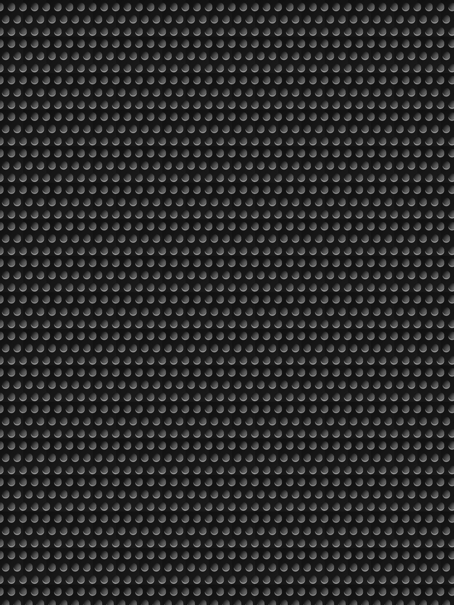

# B2S ScreenRes files

## Three screen setup

### Imagine, you have a VPX recreation of a EM Pinball "Wizard" from the 60'th:


### And you want to add the backglass:

<kbd>
</kbd>


### To your backglass Monitor:
<div>
<kbd>
    <p></kbd>
</p></div>


### The backglass will look a little squeezed:

<div align="left">
<kbd> 
    <p></kbd> 
</p>
</div>

<details>
  <summary>Screenres file</summary>

``` Python
# This is a ScreenRes file for the B2SBackglassServer. 
# From release 1.3.1.1 comment lines like this starting with a "#" are supported. 
# If you use tools not supporting comments (or old releases), you need to remove these lines or let B2S_ScreenResIdentifier do it for you!
# Playfield Screen resolution width/height
2560
1440
# Backglass width/height (or background when StartBackground is active)
1920
1080
# Backglass Display Devicename screen number (\\.\DISPLAY)x for the Playfield or screen on position (@x) or screen index (=x)
2
# X/Y position for the backglass relative to the upper left corner of the selected screen (background when StartBackground is active)
0
0
# width/height of the DMD area in pixels - For 3 screen setup (DMD gets defaults when set to 0/0)
0
0
# X/Y position of the DMD area relative to the upper left corner of the backglass screen - For 3 screen setup
0
0
# Y-flip, flips the LED display upside down
0
# Backglass X/Y position when StartBackground is active, relative to upper left corner of the selected screen
0
0
# Backglass width/height when StartBackground is active
0
0
# C:\path\Frame = The path to the location where you have the background image or black if none selected.
#C:\path\my_bezel_for_EM_or_grill_for_dual_screen.png
```

</details>


### You can then add the background (small button):

<div align="left">
<kbd> 
    <p></kbd> 
</p>
</div>

<details>
  <summary>Screenres file</summary>

``` Python
# This is a ScreenRes file for the B2SBackglassServer. 
# From release 1.3.1.1 comment lines like this starting with a "#" are supported. 
# If you use tools not supporting comments (or old releases), you need to remove these lines or let B2S_ScreenResIdentifier do it for you!
# Playfield Screen resolution width/height
2560
1440
# Backglass width/height (or background when StartBackground is active)
1920
1080
# Backglass Display Devicename screen number (\\.\DISPLAY)x for the Playfield or screen on position (@x) or screen index (=x)
2
# X/Y position for the backglass relative to the upper left corner of the selected screen (background when StartBackground is active)
0
0
# width/height of the DMD area in pixels - For 3 screen setup (DMD gets defaults when set to 0/0)
0
0
# X/Y position of the DMD area relative to the upper left corner of the backglass screen - For 3 screen setup
0
0
# Y-flip, flips the LED display upside down
0
# Backglass X/Y position when StartBackground is active, relative to upper left corner of the selected screen
420
0
# Backglass width/height when StartBackground is active
1080
1080
# C:\path\Frame = The path to the location where you have the background image or black if none selected.
#C:\path\my_bezel_for_EM_or_grill_for_dual_screen.png
```

</details>

### Imagine, you have a VPX recreation of a SS Pinball "Space" from the 80'th:


### And you want to add the backglass:

<kbd>
</kbd>


### To your backglass Monitor:
<div>
<kbd>
    <p></kbd>
</p></div>


### The backglass will look a little squeezed:

<div align="left">
<kbd> 
    <p></kbd> 
</p>
</div>

<details>
  <summary>Screenres file</summary>

``` Python
# This is a ScreenRes file for the B2SBackglassServer. 
# From release 1.3.1.1 comment lines like this starting with a "#" are supported. 
# If you use tools not supporting comments (or old releases), you need to remove these lines or let B2S_ScreenResIdentifier do it for you!
# Playfield Screen resolution width/height
2560
1440
# Backglass width/height (or background when StartBackground is active)
1920
1080
# Backglass Display Devicename screen number (\\.\DISPLAY)x for the Playfield or screen on position (@x) or screen index (=x)
2
# X/Y position for the backglass relative to the upper left corner of the selected screen (background when StartBackground is active)
0
0
# width/height of the DMD area in pixels - For 3 screen setup (DMD gets defaults when set to 0/0)
0
0
# X/Y position of the DMD area relative to the upper left corner of the backglass screen - For 3 screen setup
0
0
# Y-flip, flips the LED display upside down
0
# Backglass X/Y position when StartBackground is active, relative to upper left corner of the selected screen
0
0
# Backglass width/height when StartBackground is active
0
0
# C:\path\Frame = The path to the location where you have the background image or black if none selected.
#C:\path\my_bezel_for_EM_or_grill_for_dual_screen.png
```

</details>

### You can then add the background (small button):

<div align="left">
<kbd> 
    <p></kbd> 
</p>
</div>

<details>
  <summary>Screenres file</summary>

``` Python
# This is a ScreenRes file for the B2SBackglassServer. 
# From release 1.3.1.1 comment lines like this starting with a "#" are supported. 
# If you use tools not supporting comments (or old releases), you need to remove these lines or let B2S_ScreenResIdentifier do it for you!
# Playfield Screen resolution width/height
2560
1440
# Backglass width/height (or background when StartBackground is active)
1920
1080
# Backglass Display Devicename screen number (\\.\DISPLAY)x for the Playfield or screen on position (@x) or screen index (=x)
2
# X/Y position for the backglass relative to the upper left corner of the selected screen (background when StartBackground is active)
0
0
# width/height of the DMD area in pixels - For 3 screen setup (DMD gets defaults when set to 0/0)
0
0
# X/Y position of the DMD area relative to the upper left corner of the backglass screen - For 3 screen setup
0
0
# Y-flip, flips the LED display upside down
0
# Backglass X/Y position when StartBackground is active, relative to upper left corner of the selected screen
420
0
# Backglass width/height when StartBackground is active
1080
1080
# C:\path\Frame = The path to the location where you have the background image or black if none selected.
#C:\path\my_bezel_for_EM_or_grill_for_dual_screen.png
```

</details>

## Wrapping Text Around Image

<div align="right">
<kbd> 
    <p></kbd> 
</p>
</div>

Lorem Ipsum is simply dummy text of the printing and typesetting industry. Lorem Ipsum has been the industry's standard dummy text ever since the 1500s, when an unknown printer took a galley of type and scrambled it to make a type specimen book. It has survived not only five centuries, but also the leap into electronic typesetting, remaining essentially unchanged. It was popularised in the 1960s with the release of Letraset sheets containing Lorem Ipsum passages, and more recently with desktop publishing software like Aldus PageMaker including versions of Lorem Ipsum.

